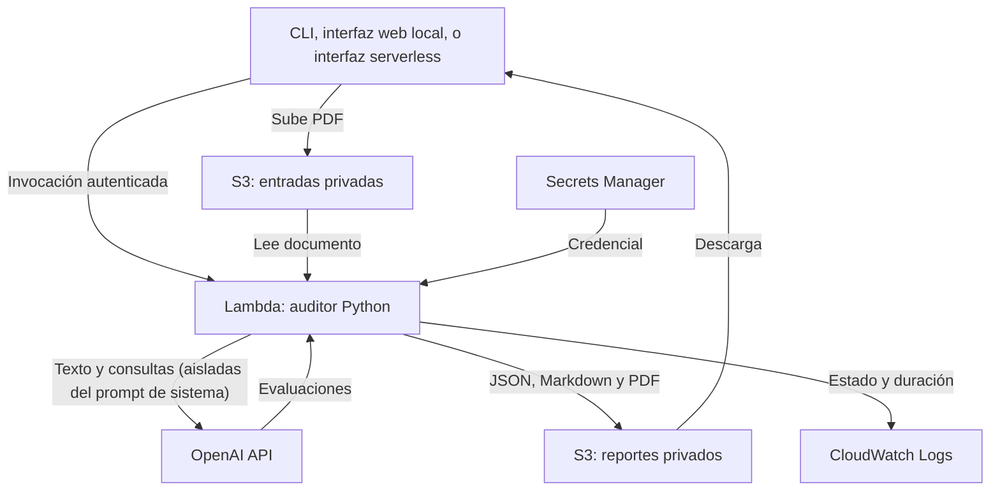

> Variante **CORREGIDA**. Consulta [la comparación de modalidades](docs/comparison.md).

# Privacy Notice Auditor — NLP on AWS

Auditoría asistida de avisos de privacidad en PDF contra la Ley Federal de Protección de
Datos Personales en Posesión de los Particulares (LFPDPPP) de México: extrae el texto del
PDF, evalúa nueve reglas normativas con un LLM, cita la evidencia textual encontrada por
cada una, detecta si el aviso cita una autoridad de control ya desactualizada (INAI/IFAI en
vez de la Secretaría Anticorrupción y Buen Gobierno), y entrega un veredicto global con
reportes en JSON/Markdown/PDF. Proyecto de portafolio de NLP aplicado: extracción de PDF
sensible a maquetación, evaluación con LLM con aislamiento contra prompt injection,
recuperación semántica (RAG) para documentos que exceden la ventana de contexto, e
infraestructura como código en AWS.

**Estado:** desplegado y validado de extremo a extremo en una cuenta personal de AWS (ver
[docs/decisions.md](docs/decisions.md) para lo que falta antes de operarlo con datos reales
de terceros). No sustituye una revisión legal — ver [Alcance del resultado](#alcance-del-resultado).

## Objetivo

Automatizar la primera pasada de una auditoría de cumplimiento de un aviso de privacidad,
sin pretender reemplazar el criterio de un abogado:

- **Evidencia, no solo veredicto** — cada una de las nueve reglas trae la cita textual del
  aviso que sustenta el dictamen, o "Ninguna" si no encontró nada. Un `No cumple` sin
  evidencia es tan revisable como un `Cumple total` con ella.
- **Revisión humana incorporada, no un extra** — tanto el CLI (`--revisar`) como las
  interfaces web permiten confirmar, corregir o anotar cada dictamen antes de descargar el
  reporte final; el veredicto de un humano siempre pesa más que el de la IA.
- **Portátil entre modos de operación** — el mismo núcleo de auditoría (`app/audito_rag_pdf.py`)
  corre igual desde una terminal, una interfaz web local, o una interfaz serverless con URL
  pública; ninguno de los tres reimplementa la lógica de auditoría por separado.

## Arquitectura



El Lambda de auditoría (`app/worker.py` + `app/audito_rag_pdf.py`) es el mismo sin importar
cómo se le invoque. Lo que cambia entre modos es solo la orquestación alrededor:

| Modo | Cómo invoca al Lambda | Cuándo usarlo |
|---|---|---|
| **CLI** (`scripts/audit.py`) | Invocación síncrona directa, boto3 desde tu terminal | Validar el pipeline, uso personal |
| **Web local** (`webapp/`, `webapp-pdf/`) | Igual que el CLI, pero con una página en tu máquina | Enseñarlo sin usar la terminal, sigue en tu laptop |
| **Serverless** (`serverless/` + `infra/webapp_stack.py`) | API Gateway → Lambda → SQS → Lambda → el mismo Lambda de auditoría | Piloto con varios testers, sin depender de una máquina prendida |

Ninguno reintenta automáticamente ante un error de red, para no repetir llamadas pagadas a
OpenAI. No hay garantía de idempotencia si reenvías el mismo trabajo.

## Recrear el proyecto con recursos propios

Vas a necesitar: una cuenta de AWS propia, una API key de OpenAI con acceso a `gpt-4o` y
`gpt-4o-mini`, Python 3.12, Node.js 20+, Docker Desktop corriendo, y AWS CLI v2.

### 1. Clonar e instalar

```bash
git clone https://github.com/Michell-Mar/NLP-auditoria-rag.git
cd NLP-auditoria-rag/nlp-aws-corregido
python3.12 -m venv .venv && source .venv/bin/activate
pip install -r requirements-dev.txt
npm install   # instala la versión de aws-cdk fijada en package.json (no una global)
python -m pytest -q   # corre sin AWS ni OpenAI reales; confirma que todo importa bien
```

### 2. Autenticar tu cuenta de AWS

Para un proyecto personal, lo más simple es un usuario de IAM dedicado (no la cuenta raíz,
no tu usuario del día a día):

```bash
aws configure --profile nlp-dev   # pide Access Key ID / Secret Access Key / región
aws sts get-caller-identity --profile nlp-dev
export AWS_PROFILE=nlp-dev AWS_REGION=us-east-1
```

Si tu organización usa IAM Identity Center, `aws configure sso --profile nlp-dev` es la
alternativa — ver [docs/deployment.md](docs/deployment.md).

### 3. Crear el secreto de OpenAI

```bash
python scripts/create_secret.py --profile nlp-dev --region us-east-1
export NLP_SECRET_ARN=$(aws secretsmanager describe-secret --secret-id nlp-audit/openai \
  --profile nlp-dev --region us-east-1 --query ARN --output text)
```

### 4. Bootstrap y despliegue del stack base

```bash
export NLP_ACCOUNT_ID=$(aws sts get-caller-identity --profile nlp-dev --query Account --output text)
npx cdk bootstrap aws://$NLP_ACCOUNT_ID/$AWS_REGION -c openaiSecretArn="$NLP_SECRET_ARN"
npx cdk deploy NlpAuditStack -c openaiSecretArn="$NLP_SECRET_ARN" --outputs-file cdk-outputs.json
```

Esto crea los dos buckets S3, el Lambda de auditoría y el log group. Anota `FunctionName`,
`InputBucket` y `ResultBucket` de `cdk-outputs.json` — los necesitas en el paso 6.

### 5. Validar con una auditoría real

```bash
python scripts/audit.py /ruta/a/un_aviso_de_privacidad.pdf --profile nlp-dev --region us-east-1
```

Revisa `downloads/<job_id>/` — deberías ver las nueve reglas con evidencia. No subas PDFs de
terceros ni reportes reales al repo sin autorización.

### 6. (Opcional) Desplegar una interfaz web

Para probarlo en tu propia máquina sin usar la terminal cada vez:

```bash
pip install -r webapp-pdf/requirements.txt
python webapp-pdf/server.py --profile nlp-dev --region us-east-1
```

Para un piloto con varios testers a la vez, sin depender de tu laptop (API Gateway + 2
Lambdas + SQS + DynamoDB, reutilizando el mismo Lambda de auditoría sin tocarlo):

```bash
npx cdk deploy WebappStack -c openaiSecretArn="$NLP_SECRET_ARN" \
  -c auditFunctionName="<FunctionName del paso 4>" \
  -c auditInputBucket="<InputBucket del paso 4>" \
  -c auditResultBucket="<ResultBucket del paso 4>" \
  --outputs-file cdk-outputs-webapp.json
```

La URL sale en `SiteUrl` de `cdk-outputs-webapp.json` — **ese archivo no debe subirse al
repo** (ya está en `.gitignore`; contiene la URL pública y nombres de recursos de tu cuenta).
Detalles, límites conocidos y cómo probarla en
[docs/webapp.md](docs/webapp.md) / [docs/webapp-pdf.md](docs/webapp-pdf.md) /
[docs/webapp-serverless.md](docs/webapp-serverless.md).

### 7. Eliminar todo

```bash
npx cdk destroy WebappStack -c openaiSecretArn="$NLP_SECRET_ARN" \
  -c auditFunctionName="<FunctionName>" -c auditInputBucket="<InputBucket>" -c auditResultBucket="<ResultBucket>"
npx cdk destroy NlpAuditStack -c openaiSecretArn="$NLP_SECRET_ARN"
```

Los buckets tienen `RemovalPolicy.RETAIN` (se conservan con una expiración de 7 días sobre
sus objetos); bórralos a mano si ya no los necesitas. El secreto de Secrets Manager se creó
fuera del stack y también se conserva.

## Contenido del repositorio

| Ruta | Propósito |
|---|---|
| `app/audito_rag_pdf.py` | Núcleo de auditoría: extracción de PDF, segmentación, RAG, prompt endurecido contra inyección, revisión humana por CLI |
| `app/worker.py` | Adaptación a Lambda del núcleo, aislamiento temporal por auditoría |
| `app/Dockerfile` | Imagen Python 3.12 compatible con Lambda x86_64 |
| `infra/app.py` | `AuditStack`: buckets, Lambda de auditoría, permisos, secreto, outputs |
| `infra/webapp_stack.py` | `WebappStack`: API Gateway, 2 Lambdas, SQS, DynamoDB — reutiliza el Lambda de `AuditStack` sin modificarlo |
| `scripts/create_secret.py` | Creación inicial del secreto de OpenAI desde una entrada oculta |
| `scripts/audit.py` | Subida, invocación y descarga por CLI |
| `webapp/` | Interfaz web local (Markdown) |
| `webapp-pdf/` | Interfaz web local (PDF) |
| `serverless/` | Interfaz web serverless, con su propia URL pública |
| `tests/` | Pruebas sin AWS ni llamadas reales a OpenAI, más `aws_cdk.assertions.Template` sobre el CloudFormation real |
| `.github/workflows/ci.yml` | Validación automática en push y pull request |
| `docs/deployment.md` | Instalación, despliegue, ejecución y eliminación (CLI) |
| `docs/webapp.md`, `docs/webapp-pdf.md`, `docs/webapp-serverless.md` | Cada interfaz web |
| `docs/decisions.md` | Decisiones, límites y costos conocidos |
| `docs/evaluation.md` | Plan de evaluación para presentar resultados verificables |

## Escalar a producción real: qué cambiaría

Esta base está pensada para un portafolio y un piloto acotado. Antes de operarlo con
usuarios reales y volumen real, esto es lo que cambiaría, agrupado por qué tan urgente es:

### Seguridad y acceso — antes de exponerlo a cualquiera
- **Autenticación real.** Hoy `serverless/` no tiene login propio ("el link es el secreto").
  Para más de un puñado de testers invitados, agrega Cognito, un API key por usuario en API
  Gateway, o al menos una contraseña compartida (HTTP Basic Auth) delante del sitio.
- **Nada de usuarios raíz ni credenciales de larga duración.** Un rol de IAM por servicio,
  con permisos acotados al recurso exacto (ya es el patrón en `infra/`, pero verifícalo con
  cada recurso nuevo que agregues).
- **CORS del bucket de entradas.** Hoy `allowed_origins=["*"]` en `infra/app.py` porque no se
  conocía el dominio final de antemano. Acótalo al dominio real una vez que exista.
- **Rate limiting y WAF** en API Gateway — sin esto, alguien con el link puede saturar la
  cola o disparar gasto sin límite salvo el `max_concurrency` fijo del worker.

### Costos y límites — antes de un volumen real
- **Techo de gasto real, no solo `max_tokens` por llamada.** El límite actual acota el costo
  de *una* llamada; nada acota el gasto acumulado de una auditoría completa ni de un día.
  Necesitas un circuit breaker por auditoría/usuario/día (contador en DynamoDB o alarma de
  Cost Explorer que corte el flujo).
- **`max_concurrency=3` es arbitrario**, calibrado para un piloto pequeño. A escala real,
  súbelo con base en tu presupuesto real de OpenAI, no en una suposición.
- **Modelo por regla.** Las nueve reglas usan `gpt-4o` parejo; a escala vale la pena evaluar
  `gpt-4o-mini` para las reglas más simples, o consolidar las nueve evaluaciones en una sola
  llamada (se discutió, no se implementó) para bajar el costo por auditoría.
- **Alertas de presupuesto de AWS y del proveedor de OpenAI** configuradas *antes* de abrir
  el acceso, no después.

### Infraestructura y escalabilidad
- **Frontend fuera del Lambda.** Hoy `serverless/app.py` sirve sus propios archivos
  estáticos; a escala real eso va a S3 + CloudFront (caché, dominio propio, certificado TLS
  administrado, WAF).
- **Dominio propio con ACM** en vez de la URL genérica de `execute-api.amazonaws.com`.
- **Estado del job en DynamoDB sin backup.** Activa point-in-time recovery si el historial de
  auditorías importa; hoy solo hay TTL de limpieza, no respaldo.
- **Límites de cuenta de AWS.** Concurrencia de Lambda, throughput de SQS y de DynamoDB
  on-demand tienen techos por cuenta/región — con volumen real, pide aumento de cuota antes
  de necesitarlo, no durante un incidente.
- **Multi-región / continuidad**, si el producto necesita disponibilidad más allá de
  `us-east-1`. Hoy no existe ningún plan de recuperación ante desastre.

### Observabilidad y operación
- **Alarmas, no solo logs.** Profundidad de la DLQ, tasa de error del worker, latencia p95 —
  hoy solo hay `CloudWatch Logs` planos, sin ninguna alarma configurada.
- **Trazabilidad distribuida (X-Ray o similar).** El flujo ya cruza 3 Lambdas (API, worker de
  cola, worker de auditoría) más SQS y S3; depurar un caso lento sin trazas es adivinar.
- **CI/CD de infraestructura.** Hoy el despliegue es manual desde una laptop. Para operarlo en
  equipo, agrega GitHub Actions con OIDC (sin llaves de larga duración) y `cdk diff` como
  gate antes de aplicar cambios — la CI actual solo prueba, no despliega.

### Calidad y validación
- **La calidad normativa de las nueve reglas no está validada por un experto legal.** A mayor
  escala, un veredicto incorrecto tiene consecuencias reales para quien lo use — antes de
  afirmar cobertura, sigue [el plan de evaluación](docs/evaluation.md) con un abogado
  revisando una muestra real.
- **El endurecimiento contra prompt injection es un primer paso, no una garantía.** Se
  validó contra intentos directos y explícitos; a escala, vale la pena un ejercicio de
  red-teaming más sistemático antes de confiar el veredicto a documentos no confiables por
  completo.
- **Retrieval-augmented generation solo probado en un puñado de avisos reales.** Antes de
  prometer cobertura para "cualquier aviso", valida la segmentación por secciones y el MMR
  contra una muestra más amplia y diversa de formatos reales (bancos, aseguradoras,
  universidades, comercios).

## Alcance del resultado

Los dictámenes y el porcentaje del script son salidas heurísticas de un prototipo; la
calidad normativa no ha sido validada como parte de este despliegue. Antes de afirmar
cobertura legal, documenta la versión de las fuentes, revisa los nueve criterios con un
experto y evalúa sus limitaciones. Consulta [el plan de evaluación](docs/evaluation.md).

## Cómo presentarlo en GitHub

Publica este contenido en tu repo sin cambiar archivos existentes de forma indiscriminada.
Incluye una captura o video de una ejecución con un documento sintético, un reporte de
ejemplo revisado y una tabla de métricas reales. Los comentarios del código nuevo están en
inglés; la documentación está en español.

La CI está implementada. El despliegue continuo no está configurado: requiere el repositorio
y los roles concretos de AWS. Para añadirlo, utiliza
[GitHub OIDC para AWS](https://docs.github.com/actions/deployment/security-hardening-your-deployments/configuring-openid-connect-in-amazon-web-services),
con confianza limitada a tu repo y entorno, y revisión de `cdk diff` antes de aplicar cambios.
