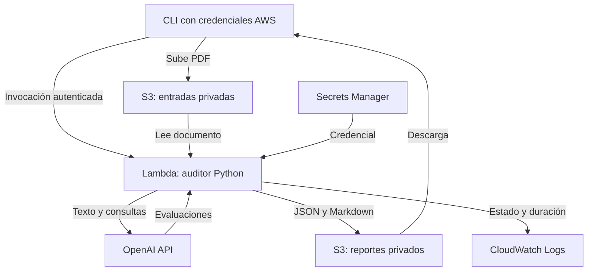

> Variante **ORIGINAL**. Consulta [la comparación de modalidades](docs/comparison.md).

# Privacy Notice Auditor — NLP on AWS

Auditoría asistida de avisos de privacidad en PDF, con evidencia textual por criterio y reportes JSON/Markdown. Proyecto de portafolio de NLP: extracción de PDF, evaluación con LLM, recuperación semántica para documentos largos e infraestructura como código.

**Estado:** base de despliegue preparada; requiere desplegarse y validarse en tu cuenta AWS. No se han medido precisión, latencia ni costos reales. Esta versión se opera mediante terminal autenticada con AWS; no incluye interfaz web pública.

## Qué demuestra este repositorio

- Pipeline Python con extracción sensible a columnas y segmentación por secciones.
- Evaluación por nueve reglas; documento completo hasta 60,000 caracteres, embeddings y MMR para documentos mayores. El umbral es de caracteres, no una garantía de tokens.
- Contenedor de Lambda y AWS CDK en Python: configuración versionable y revisable.
- S3 privado, permisos del worker limitados por recurso, secretos fuera del código y logs sin extractos del documento.
- CI que prueba el adaptador y la infraestructura, y construye la imagen.

El texto del PDF se envía a OpenAI. AWS ejecuta la aplicación; los modelos permanecen en OpenAI. La revisión interactiva humana del script original sigue disponible **localmente** mediante `--revisar`.

## Arquitectura



La subida a S3 no dispara la auditoría: el CLI la invoca una sola vez de forma síncrona y espera la respuesta. No hay reintentos automáticos del cliente para evitar repetir llamadas pagadas ante un error de red. No hay garantía de idempotencia si el usuario vuelve a enviar el trabajo.

## Contenido

| Ruta | Propósito |
|---|---|
| `app/audito_rag_pdf.py` | Script recibido intacto; vectorización previa a la selección del contexto |
| `app/worker.py` | Adaptación a Lambda y aislamiento temporal por auditoría |
| `app/Dockerfile` | Imagen Python 3.12 compatible con Lambda x86_64 |
| `infra/app.py` | Buckets, Lambda, permisos, retención y outputs |
| `scripts/create_secret.py` | Creación inicial del secreto desde una entrada oculta |
| `scripts/audit.py` | Subida, invocación y descarga |
| `tests/` | Pruebas sin AWS ni llamadas reales a OpenAI |
| `.github/workflows/ci.yml` | Validación automática en push y pull request |
| `docs/deployment.md` | Instalación, despliegue, ejecución y eliminación |
| `docs/decisions.md` | Decisiones, límites, costos y siguientes entregas |
| `docs/evaluation.md` | Plan de evaluación para presentar resultados verificables |

## Inicio

Sigue [la guía de despliegue](docs/deployment.md). Necesitarás AWS CLI v2, Docker, Node.js 22, Python 3.12, una cuenta AWS y una API key de OpenAI con acceso a los modelos del script.

Después de desplegar:

```bash
python scripts/audit.py /ruta/aviso.pdf --profile nlp-dev --region us-east-1
```

Se generan reportes en `downloads/<job_id>/`. No publiques PDFs de terceros, reportes reales ni claves sin revisar su contenido y autorización.

## Cómo presentarlo en GitHub

Publica este contenido en tu repo sin cambiar archivos existentes de forma indiscriminada. Incluye una captura o video de una ejecución con un documento sintético, un reporte de ejemplo revisado y una tabla de métricas reales. Los comentarios del código nuevo están en inglés; la documentación está en español.

La CI está implementada. El despliegue continuo no está configurado: requiere el repositorio y los roles concretos de AWS. Para añadirlo, utiliza [GitHub OIDC para AWS](https://docs.github.com/actions/deployment/security-hardening-your-deployments/configuring-openid-connect-in-amazon-web-services), con confianza limitada a tu repo y entorno, y revisión de `cdk diff` antes de aplicar cambios.

## Alcance del resultado

Los dictámenes y el porcentaje del script son salidas heurísticas de un prototipo; la calidad normativa no ha sido validada como parte de este despliegue. Antes de afirmar cobertura legal, documenta la versión de las fuentes, revisa los nueve criterios con un experto y evalúa sus limitaciones. Consulta [el plan de evaluación](docs/evaluation.md).
